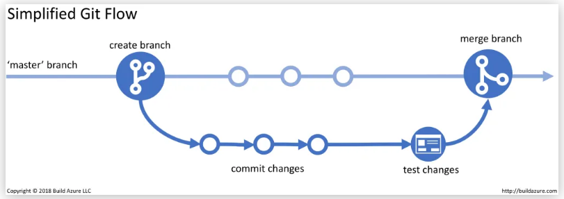
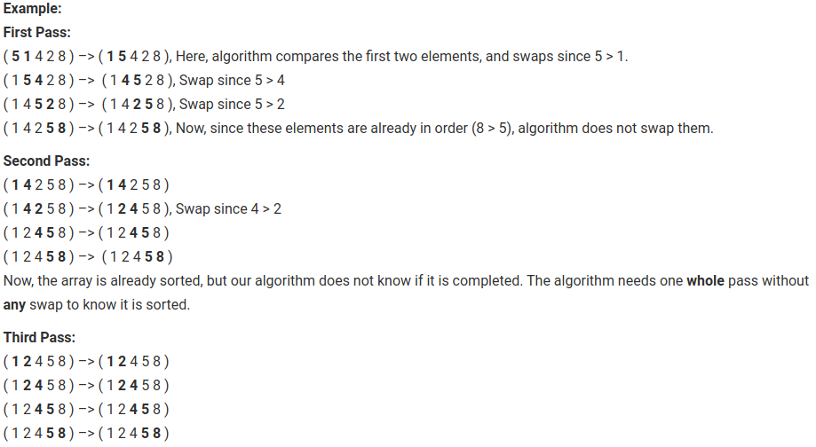
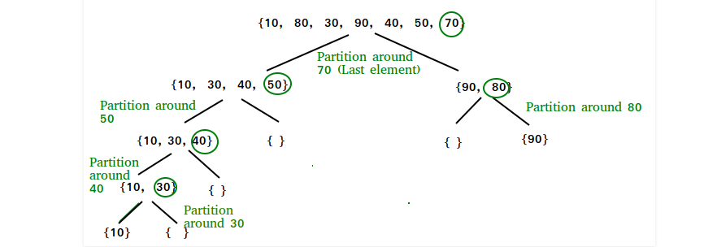
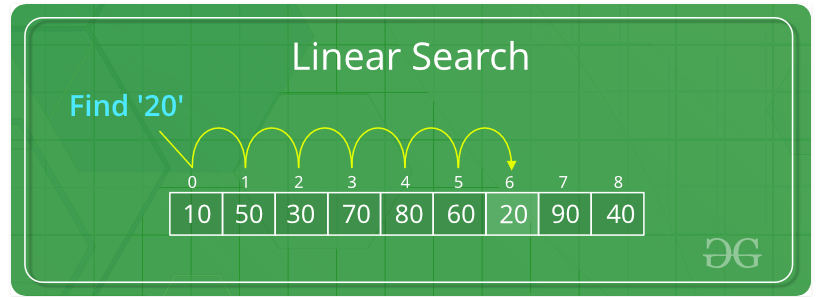
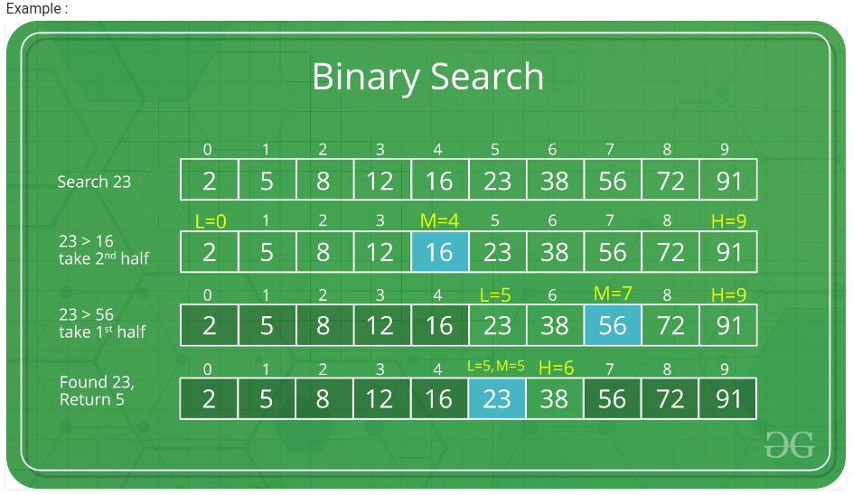
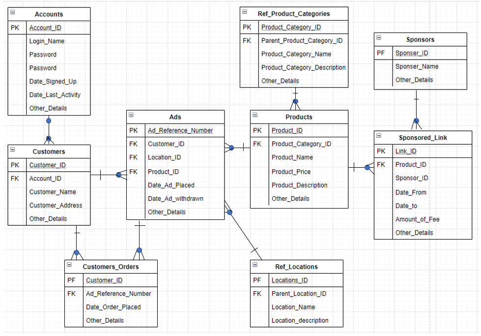

# Jeremy Wu - T2A1 - Workbook - RfQ Response

## Q1. Describe the architecture of a typical Rails application

Ruby on Rails uses a software design pattern or architecture called MVC, which is short for model, view and controller. In a Ruby on Rails application, the model is used for business logic to create rules for the data that is represented in a database. For example a database has a listing table and a genre table that is connected to the listing table by a reference id, which then in the genre model would need to create a rule that genre belongs to the listing model and then that a listing model has one genre. The view is used for the front-end of the application which uses HTML and embedded Ruby code. The embedded Ruby code is used to call variables and create loops in HTML, which could be used to render multiple listings in a database by creating a loop and calling variables listed in the database.  The controller is used for connecting both model and view to pass through data from the model to the view for it to render on the browser.  The data sent from the model to the controller can be then used to create functions in the controller, the functions that could be used for the data is create, read, update and destroy which is also known as CRUD. An example of CRUD being used in a controller would be a listing in a marketplace application that allows users to create, view, edit and destroy a listing. 

## Q2. Identify a database management system (DBMS) commonly used in web applications (including Rails) and discuss the pros and cons of this database

PostgreSQL, also known as Postgres, is an open source object-relational database. This database is commonly used in web applications such as reddit, spotify and also twitch.tv which is also built on Ruby on Rails framework. 

### Pros:

Provides application and parameter security which in the application security point of view,  different permissions can be given to different users, such as an admin account for the owner of the site and site viewing permissions to everyday site users. PostgreSQL has great extensibility which makes the database not fixed and allows users to add or change features without much difficulty as  other databases would have. Code comment can be applied to postgreSQL, this is useful as code comments help provide a small description of a particular part of the database, which most other databases don't do. 

### Cons:

Due to PostgreSQL having a relational database structure, it has slower performance compared to other databases as it needs to start at the first row of the table then read to the last row, which in some cases, tables could be very large and take time to find the relevant data needed. 

## Q3. Discuss the implementation of Agile project management methodology

The project management style called Agile is a way that teams manage and create a project plan. According to the Agile manifesto, the better way to develop software is, individuals and interactions over processes and tools, working software over comprehensive documentation, customer collaboration over contract negotiation and responding to change over following a plan. The way that agile project management works is by the developer and the customer/stakeholder having a closer business relationship as they need to communicate frequently as the project moves forward to start to finish. The communication starts by the business side of the project team keeping frequent contact with the customer or stakeholder to see if changes or additional features need to be added to the project, which then needs to be relayed back to the developers, so they can implement the new changes. The communication between the business side and the developers must be efficient and effective as face to face meetings are usually done. From start to finish, an agile project is to maximize customer satisfaction, so if changes need to be added near the end of the project, developers will need to work fast and efficiently to get the job done, reason why more motivated individuals are more likely to succeed in an agile project. Comparing agile to waterfall method of project management, waterfall has stages in a project that need to be followed and completed before the next while agile is more free flowing as more new features may be needed to be added throughout the project. 

## Q4. Provide an overview and description of a standard source control workflow

Source or version control is defined as tracking and managing changes to code, which is used to help to provide history to code changes, that can be useful if new code has failed, developers can revert back to the older version of the code that was working. A source management system called Git is used for source control of nearly all development projects as the Git system is able to store and track different changes of code in a project. This is done by a project uploaded to a repository, where usually multiple branches are created such as a test, development and master branch, this is to keep code tidy and go through a testing process before being copied to main code. Commits are the way Git tracks different changes to code, by the user pushing new code into their repository and usually leaving a comment on what they changed or add to the code.  

## Q5. Provide an overview and description of a standard software testing process

Software testing is a process of checking software to be able to work as intended as the checking process goes through an actual result, which is the result of the test and the expected result, which is the wanted outcome of the test. This identifies errors, missing features and security vulnerabilities in software to develop fully functional applications. There are alot of different types of software testing but usually goes through stages of development, where discussion of how the code is tested, to develop a strategy to test what features and create a testing schedule. The next stage is designing tests for the features, for example if a user needs to provide credit card details for a purchase, that card number field must only accept numbers and the correct amount of numbers. Then the next stages are to execute the created test and then check and log the final result of the test to see what needs to be fixed or features that are working as intended. Manual testing is manually applying tests to cases without any automation tools, which is known as the most simple form of testing. Usually new applications are manually tested before being able to be automatically tested. 

## Q6. Discuss and analyse requirements related to information system security and how they relate to the project 

Information system security is the practice of keeping information safe and accessible while keeping its integrity. Information system security usually includes protecting information such as personal information or source code, also the detection of security breaches, which then should be fixed and documented and access control which is used to control abilities an user has on an application. The most common security practice in any web application are HTTP security headers, which provides some layer of security to prevent breaches by communicating to the browser what information can be requested. Another type of information security example would be Ruby on Rails in built security, which are object relational mapping framework called ActiveRecord, which works with the database to prevent SQL injection. Rails also prevents cross-site request forgery attacks by including authenticity tokens in HTML responses as a default setting. 

## Q7. Discuss common methods of protecting information and data and how you would apply them to the project

Common methods used to protect information and data, is to encrypt data, authorisation, http headers and access control. The Ruby gem called devise is a way developers can protect their Rails web application, as it provides the ability for access control and authorisation, that makes users create an account on the site to have certain access to the web application. Accounts can also be split into different permission categories, such as site user and an admin user which can help control certain information on a site. The devise gem also encrypts the users password by turning the users password in the database to an encrypted string, so it becomes much more difficult for someone to receive and log on to someone else's account on the site.  HTTP security headers is another great way to protect an web application by controlling the data that is received and sent from the browser. 

## Q8. Research what your legal obligations are in relation to handling user data and how they can be met for the project

The legal obligations that need to be met for handling user data, is provided by the Australian Cyber Security Centre, as there are guidelines given for software development security.  All legal obligations fall under the Intelligence Services Act 2001. According to the Australian Cyber Security Centre, information security manual, different development environments should be used to minimise and limit the spread of faulty and malicious code, this can be implemented by having a testing and production branch, also known as source control. For most web application, input handing is essential security practice, as correct input parameters are applied, for example, an image input should only allow different types of image type files, such as PNG or JPEG, if correct parameters are not set, malicious users could place an excusable file that can breach the web applications security. Good software testing can be used to reduce security vulnerabilities in a web application, as flaws can be found and fixed before production.   

## Q9. Describe the structural aspects of the relational database model. Your description should include information about the structure in which data is stored and how relations are represented in that structure.

Relational database model is a method of holding specific data which can be retrieved by calling queries. Mostly all the relational database uses the SQL data definition and query language as it is designed around relational databases by contents of a table having rows and columns. A column of the table holds the attributes that are related to the table and the row holds the description or value of the attributes. For example a user table would hold a username and a password attribute and then the description of the attribute would be a string for the username and a encrypted string for the password. A reaction schema is also used to display names of the relation to attributes, which for example, an listing table may hold a user_id, also known as a foreign key, which is related to the user table. 

## Q10. Describe the integrity aspects of the relational database model. Your description should include information about the types of data integrity and how they can be enforced in a relational database. 

Data integrity is the practice of a database storing correct and accurate data. Methods that help with data integrity are valid data and input, removing duplicates, backing up data, control access and Log history. Having valid data and input helps keep data integrity by not allowing the wrong input of data, for example in a marketplace web application, an user can create a listing and input data such as title, description, price and an image. The listing should only allow certain data to be inputted into each of the fields, such as the title and description can only hold string data, the price can only hold integer data and the image can only hold image type files, by doing this, it ensures that correct and useful data is being stored. Removing duplicate data or old data can also keep good data integrity, for example, regularly checking users listings in a marketplace, to see if a user has accidentally inputted two of the same listing or applying a timeframe for a listing before it is automatically deleted, to avoid duplicates or unused data. 

## Q11. Describe the manipulative aspects of the relational database model. Your description should include information about the ways in which data is manipulated (added, removed, changed, and retrieved) in a relational database. 

Data manipulation language is a program language used for databases that need to insert, delete or update data. SQL also known as a Structured Query Language is the most common sublanguage that is used for relational databases. The two most common types of data manipulation is relational assignment operator or relational algebra. Relational assignment operator is a method of how data is controlled in the database by INSERT, DELETE and UPDATE. The term INSERT is the action for adding a single of multiple records in a table. DELETE is to remove a record from the table while UPDATE is to edit a record in the table. Relational algebra in a database is used to obtain data relations input to relations output, which there are various operations such as SELECT, PROJECT and RENAME. SELECT is used for selecting a subset of tuples and the PROJECT is used to remove attributes of an input relation. 

## Q12. Identify and explain the workings of TWO SORTING algorithms and discuss and compare their performance/efficiency

Bubble Sort is a basic sorting algorithm that is done repetitively until the list is sorted. The way that this basic algorithm works is by a set of data repetitively being checked while adjacent values are swapped if needed, until the data is completely sorted. This way of sorting is known as quadratic or O(n^2). This algorithm usually performs poorly in the real world as a repetitive algorithm is deemed to be inefficient, the reason why bubble sorting is used to introduce concepts of sorting algorithms. Bubble sorting is best used for large simple data sets that are nearly sorted. For example, a list of employees in a company, sorted according to their roles.  

Quick sort is known to be an efficient sorting algorithm, which is the most commonly used sorting method. The time complexity of quick sort is O(n log n), also known as logarithmic and linearithmic. Quick sorting is done by a set of data being sorted by the smaller than values are moved to the left and the greater than values are moved to the right and then the sub array data is also sorted the same way. By default quick sorting is not stable for large amounts of data but if implemented correctly, it can be reliable and stable.

Comparing the performance and efficiency of both bubble sorting and quick sorting, bubble sorting is slow as it needs to check each piece of data repetitively when sorting, which can take up to multiple passes before it is sorted correctly making it not efficient. Performance can be great for large amounts of data but it must be simple data. Quick sorting is known to be the most efficient way of sorting data, as it recursively sorts each array and sub array of data. Performance of quick sorting can be unstable but it depends on input.

## Q13. Identify and explain the workings of TWO SEARCH algorithms and discuss and compare their performance/efficiency

Linear search is the method of a list or an array of data being checked for start to finish until the correct item has been searched. For example in the a array of five numbers, [15, 5, 6, 8, 10], we are looking for the number six, the search we start from number 15 then goes through number 5 then to 6, which is the correct item being searched, then the search stops, so the numbers 8 and 10 don't need to be checked. The complexity of linear search is O(n). Linear search is not the most effective method but in a small array of data it is useful but in a large array of data, this method could be very slow, depending on the position of the search item in the array.

Binary search also know as logarithmic search is the method of finding the value and position of an sorted array, This search uses the divide and conquer method that compares the searched value to the middle position value of the array and if that value does not fit into the compared value, that side of the array is then removed and a new middle position is formed in the array. Then it continues the same method until the correct value is found. The complexity of binary search is O(log n). The fallback of binary search is that it can only work if the array of data is sorted but if it is known to be effective for large arrays of sorted data. 

Comparing binary search to linear search is that binary search needs sorted data for it to work as linear does not. In efficiency binary search would be the more effecticent way as it can access data randomly as linear search needs to sequentially go through data. The performance of both binary and linear search are useful in their own way, as linear can search unsorted arrays but can be long if the array is large and binary search is faster with large arrays of data but only can search sorted arrays.  

## Q14. Conduct research into a marketplace website (app) and answer the following parts:

### a. List and describe the software used by the app.

The tech stack of gumtree includes:

React: a web framework 

Bootstrap: a CSS framework 

jQuery: a javascript library 

jQuery UI: Users interface for JS library 

Java: a programing language

Nginx: server

Modernizr: feature detection

Amazon CloudFront: Content delivery network

Google Cloud Platform: Database

### b. Describe the hardware used to host the app.

Gumtree uses Nginx to host their website. Nginx is a web server that is used for HTTP requests between the web application and the users machine and the internet. HTTP requests such as GET, PUT, POST and DELETE are used for Gumtree.com. 

### c. Describe the interaction of technologies within the app

When the user enters the site, Modernizr is used to tailor the users experience to the users liken, Then React will start the render the site with its features, such as product listings, user profiles and search function which is done by jQuery and jQuery UI. Data stored from the site used by Google Cloud Platform. 

### d. Describe the way data is structured within the app

Gumtree uses a relational database model which is implemented by Google Cloud Platform that uses datastore, which is a NoSQL database, which calls category of objects Kind instead of table, One object as Entity instead of row, individual data for an object is Property instead of Column and unique ID for an object is called key instead of primary key. 

### e. Identify entities which must be tracked by the app

There are various amounts of entities the Gumtree site needs to track but the most important ones are, accounts, customers, customers orders, ads, products, location, product categories and sponsors. All these entities need to be defined in the React web framework for these entities to be used.

### f. Identify the relationships and associations between the entities you have identified in part (e) 

Account has many customers 

Customer has one Account 

Customer has many Customer_orders

Customer_orders has one Customer

Customer has many Ads 

Ads has one Customer 

Ads has many Customer_orders

Ads has one Product 

Ads has one Ref_location 

Product has many Ads 

Product has many Sponsored_links 

Product has one Ref_product_categories 

Ref_location has many Ads

Ref_product_categories has many Products

Sponsored_links has one Product 

Sponsored_links has one Sponsors

Sponsors has many Sponsered_links 

### g. Design a schema using an Entity Relationship Diagram (ERD) 
appropriate for the database of this website (assuming a relational database model

## References

https://adrianmejia.com/ruby-on-rails-architectural-design/

https://en.wikipedia.org/wiki/Model%E2%80%93view%E2%80%93controller

https://www.postgresql.org/about/

https://en.wikipedia.org/wiki/PostgreSQL

https://www.aalpha.net/blog/pros-and-cons-of-using-postgresql-for-application-development/

https://www.wrike.com/project-management-guide/faq/what-is-agile-methodology-in-project-management/

https://www.agilealliance.org/agile101/12-principles-behind-the-agile-manifesto/

https://www.infoworld.com/article/3237508/what-is-agile-methodology-modern-software-development-explained.html

https://www.guru99.com/waterfall-vs-agile.html

https://aws.amazon.com/devops/source-control/

https://build5nines.com/introduction-to-git-version-control-workflow/

https://usersnap.com/blog/software-testing-basics/

https://www.guru99.com/software-testing-introduction-importance.html

https://www.guru99.com/manual-testing.html

https://www.techopedia.com/definition/24840/information-systems-security-infosec

https://www.senseofsecurity.com.au/the-state-of-web-application-security-in-australia/

https://www.netsparker.com/blog/web-security/ruby-on-rails-security-basics/

https://www.lrswebsolutions.com/Blog/Posts/32/Learn-More/2018/11/11-Best-Practices-for-Developing-Secure-Web-Applications/blog-post/

https://www.oreilly.com/library/view/building-web-apps/9781492042921/ch04.html

https://safecomputing.umich.edu/information-security-requirements

https://www.dpc.sa.gov.au/__data/assets/pdf_file/0003/47469/web-applicaton-security-standards.pdf

https://www.cyber.gov.au/sites/default/files/2019-03/ISM_18_Guidelines_for_Software_Development.pdf

https://www.legislation.gov.au/Details/C2020C00029

https://www.guru99.com/relational-data-model-dbms.html

https://en.wikipedia.org/wiki/Relational_model

https://afteracademy.com/blog/what-is-data-integrity

https://www.promptcloud.com/blog/7-steps-to-improve-data-integrity/

https://blog.kyoceradocumentsolutions.com.au/what-is-data-integrity

https://en.wikipedia.org/wiki/Data_manipulation_language

https://www.guru99.com/relational-algebra-dbms.html

https://www.oreilly.com/library/view/sql-and-relational/9781449319724/ch01s04.html

http://etutorials.org/SQL/SQL+Bible+Oracle/Part+IV+Retrieving+and+Transforming+Data/Chapter+11+SQL+Operators/Assignment+Operator/

https://www.geeksforgeeks.org/bubble-sort/

https://medium.com/human-in-a-machine-world/quicksort-the-best-sorting-algorithm-6ab461b5a9d0

https://adrianmejia.com/most-popular-algorithms-time-complexity-every-programmer-should-know-free-online-tutorial-course/

https://en.wikipedia.org/wiki/Bubble_sort

https://medium.com/madhash/bubble-sort-in-a-nutshell-how-when-where-4965e77910d8

https://www.geeksforgeeks.org/quick-sort/

https://en.wikipedia.org/wiki/Quicksort

https://www.geeksforgeeks.org/linear-search/

https://stackabuse.com/binary-search-in-java/

https://en.wikipedia.org/wiki/Linear_search

https://www.freecodecamp.org/news/linear-search/

https://en.wikipedia.org/wiki/Binary_search_algorithm

https://www.geeksforgeeks.org/binary-search/

https://www.gumtree.com.au/

http://www.databaseanswers.org/data_models/gumtree/index.h

https://stackshare.io/gumtree-com/gumtree-com

https://www.nginx.com/

https://cloud.google.com/